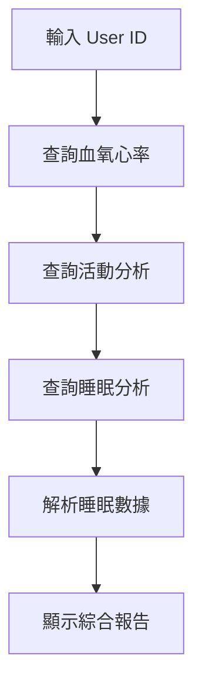
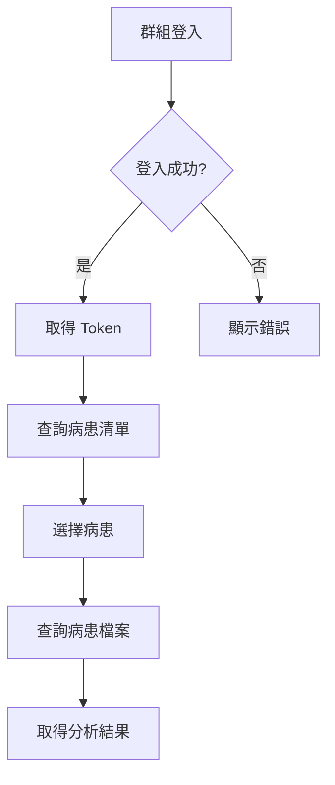

# FORA API 測試案例

> 測試頁面路徑：`/test/fora-api`

---

## API 使用說明

在元件中使用全域 `$api` 呼叫 FORA API：

```typescript
// 血氧心率查詢
const res = await $api.GetSpO2HR({
  user_id: 'xxx',
  start_dt: '2025-01-01 00:00:00',
  end_dt: '2025-01-01 23:59:59',
  mode: 0,
});

// 判斷成功
if (res.data?.ReturnCode === 0) {
  const dataList = res.data.Data;
}
```

詳細文件請參考：[FORA_API_DOCUMENTATION.md](./FORA_API_DOCUMENTATION.md)

---

## 目錄

1. [測試環境設定](#測試環境設定)
2. [FORA Ring Client API 測試案例](#fora-ring-client-api-測試案例)
3. [iFORA O2 Web API 測試案例](#ifora-o2-web-api-測試案例)
4. [整合測試流程](#整合測試流程)
5. [錯誤處理測試](#錯誤處理測試)

---

## 測試環境設定

### 前置條件

| 項目 | 說明 |
|-----|------|
| **測試帳號** | 需向 FORA 申請測試帳號 |
| **User ID** | FORA Ring 使用者加密 ID |
| **Group 帳號** | iFORA O2 Web 群組帳號 (Email) |
| **網路環境** | 需能存取 `https://www.foracare.live` |

### 測試資料範例

```typescript
// FORA Ring Client API
const ringTestData = {
  user_id: '27c2d65ed4df32c1ce5609deddc97007', // 範例 ID
  start_dt: '2025-09-23 00:00:00',
  end_dt: '2025-09-23 23:59:59',
};

// iFORA O2 Web API
const webTestData = {
  Acct: 'test@example.com',
  Pwd: 'password123',
  Lang: 'tw',
};
```

---

## FORA Ring Client API 測試案例

### TC-RING-001: 血氧心率查詢 (mode=0)

| 項目 | 內容 |
|-----|------|
| **測試目的** | 驗證血氧心率 API 正常運作 |
| **前置條件** | 有效的 user_id 和時間範圍 |
| **測試步驟** | 1. 輸入 user_id<br>2. 設定開始/結束時間<br>3. 呼叫 getSpO2HR() |
| **預期結果** | ReturnCode=0, Data 包含 spo2, hr, datetime |

**驗證項目**

- [ ] ReturnCode 為 0
- [ ] Message 為 "SUCCESS"
- [ ] Data 為陣列
- [ ] 每筆資料包含 meter_sn, spo2, hr, datetime
- [ ] spo2 範圍 0-100
- [ ] hr 範圍 30-220

**範例回應**

```json
{
  "Message": "SUCCESS",
  "ReturnCode": 0,
  "Data": [
    {
      "meter_sn": "826612448000060f",
      "spo2": 98.0,
      "hr": 69.0,
      "quality": 0,
      "hear_rate_grade": 0,
      "datetime": "2025-09-23 00:00:47",
      "d": "d"
    }
  ]
}
```

---

### TC-RING-002: 活動分析查詢 (mode=1)

| 項目 | 內容 |
|-----|------|
| **測試目的** | 驗證活動分析 API 正常運作 |
| **前置條件** | 有效的 user_id 和時間範圍 |
| **測試步驟** | 1. 輸入 user_id<br>2. 設定開始/結束時間<br>3. 呼叫 getActivity() |
| **預期結果** | ReturnCode=0, Data 包含步數、卡路里、飲食資料 |

**驗證項目**

- [ ] ReturnCode 為 0
- [ ] Data.step_num 為正整數
- [ ] Data.calorie 為 [基礎消耗, 活動消耗] 陣列
- [ ] Data.diet_data 為飲食陣列
- [ ] Data.step_data 為步數陣列
- [ ] diet_data.type 範圍 1-5

**飲食類型對照**

| type | 說明 |
|------|------|
| 1 | 早餐 |
| 2 | 午餐 |
| 3 | 晚餐 |
| 4 | 消夜 |
| 5 | 點心 |

**運動類型對照**

| state | 說明 |
|-------|------|
| 0 | 日常走路 |
| 1 | 健走 |
| 2 | 跑步 |

---

### TC-RING-003: 睡眠分析查詢 (mode=3)

| 項目 | 內容 |
|-----|------|
| **測試目的** | 驗證睡眠分析 API 正常運作 |
| **前置條件** | 有效的 user_id 和時間範圍 |
| **測試步驟** | 1. 輸入 user_id<br>2. 設定開始/結束時間<br>3. 呼叫 getSleep() |
| **預期結果** | ReturnCode=0, Data 包含睡眠分期和評分 |

**驗證項目**

- [ ] ReturnCode 為 0
- [ ] Data.start_time 格式正確
- [ ] Data.end_time 格式正確
- [ ] Data.sleep_dur 格式如 "7hr 0min"
- [ ] Data.sleep_data 可解析為 JSON 陣列
- [ ] Data.stage_summary 可解析
- [ ] Data.sleep_score 可解析

**睡眠階段對照**

| 代碼 | 階段 |
|------|------|
| 0 | 深睡 (Deep) |
| 1 | 淺睡 (Light) |
| 2 | 快速動眼 (REM) |
| 3 | 清醒 (Awake) |

**sleep_score 欄位**

| 索引 | 欄位 | 說明 |
|------|------|------|
| 0 | totalScore | 睡眠得分 |
| 1 | totalTimeScore | 睡眠總時間評分 |
| 2 | deepSleepScore | 深睡時間評分 |
| 3 | awakeRatioScore | 清醒比例評分 |
| 4 | bodyQuietScore | 身體安靜度評分 |
| 5 | lightDeepRatioScore | 淺睡+深睡比例評分 |
| 6 | bodyRestlessIndex | 身體躁動指數 |
| 7 | bodyRestlessScore | 身體躁動評分 |
| 8 | apneaScore | 呼吸中止評估 |

---

## iFORA O2 Web API 測試案例

### TC-WEB-001: 群組登入

| 項目 | 內容 |
|-----|------|
| **測試目的** | 驗證群組登入功能 |
| **前置條件** | 有效的群組帳號密碼 |
| **測試步驟** | 1. 輸入 Email<br>2. 輸入密碼<br>3. 選擇語言<br>4. 呼叫 groupLogin() |
| **預期結果** | ReturnCode=0, 取得 AccountId 和 Token |

**驗證項目**

- [ ] ReturnCode 為 0
- [ ] AccountId 不為空 (作為 group_id)
- [ ] Token 不為空 (作為後續 API 認證)
- [ ] Name 為群組名稱
- [ ] Message 為 "登入成功"

**錯誤情境**

| 情境 | 預期 ReturnCode | 預期 Message |
|------|----------------|--------------|
| 帳號錯誤 | 1 | "帳號或密碼錯誤！" |
| 密碼錯誤 | 1 | "帳號或密碼錯誤！" |

---

### TC-WEB-002: 查詢病患清單

| 項目 | 內容 |
|-----|------|
| **測試目的** | 驗證病患清單查詢功能 |
| **前置條件** | 已登入取得 group_id 和 token |
| **測試步驟** | 1. 使用登入取得的 group_id<br>2. 設定 user_join_status=1<br>3. 呼叫 getGroupUserList() |
| **預期結果** | ReturnCode=0, Data 為病患陣列 |

**驗證項目**

- [ ] ReturnCode 為 0
- [ ] Data 為陣列
- [ ] 每筆包含 user_id, email

---

### TC-WEB-003: 查詢授權清單

| 項目 | 內容 |
|-----|------|
| **測試目的** | 驗證授權清單查詢功能 |
| **前置條件** | 已登入取得 group_id 和 token |
| **測試步驟** | 1. 使用登入取得的 group_id<br>2. 設定 user_join_status=2<br>3. 呼叫 getGroupUserList() |
| **預期結果** | ReturnCode=0, Data 為授權使用者陣列 |

---

### TC-WEB-004: 查詢問答清單

| 項目 | 內容 |
|-----|------|
| **測試目的** | 驗證問答清單查詢功能 |
| **前置條件** | 已登入取得 group_id 和 token |
| **測試步驟** | 1. 使用登入取得的 group_id<br>2. 呼叫 getQAList() |
| **預期結果** | ReturnCode=0, Data 為問答陣列 |

**驗證項目**

- [ ] ReturnCode 為 0
- [ ] Data 為陣列
- [ ] 每筆包含 question_id, question_name, question_content
- [ ] 每筆包含 question_name_en, question_content_en

---

### TC-WEB-005: Token 過期處理

| 項目 | 內容 |
|-----|------|
| **測試目的** | 驗證 Token 過期時的錯誤處理 |
| **前置條件** | 使用過期的 Token |
| **測試步驟** | 1. 使用過期 Token 呼叫任意需認證 API |
| **預期結果** | ReturnCode=1099, Message 包含 "token 超過有效期限" |

**驗證項目**

- [ ] ReturnCode 為 1099
- [ ] 應用程式能正確捕獲並處理此錯誤
- [ ] 提示使用者重新登入

---

## 整合測試流程

### 流程一：FORA Ring 完整資料查詢



**測試步驟**

1. 輸入有效的 User ID
2. 設定查詢日期範圍 (建議：過去 7 天)
3. 依序執行：血氧心率 → 活動分析 → 睡眠分析
4. 驗證所有 API 回應正常
5. 驗證數據解析函式正常運作

---

### 流程二：iFORA O2 Web 群組管理



**測試步驟**

1. 使用測試帳號登入
2. 驗證取得 AccountId 和 Token
3. 查詢病患清單
4. 選擇任一病患
5. 查詢該病患檔案
6. 取得睡眠/HRV 分析結果

---

## 錯誤處理測試

### ERR-001: 網路錯誤

| 項目 | 內容 |
|-----|------|
| **測試方法** | 斷開網路連線後呼叫 API |
| **預期行為** | 顯示網路錯誤訊息，不 crash |

### ERR-002: 無效 User ID

| 項目 | 內容 |
|-----|------|
| **測試方法** | 使用不存在的 User ID 查詢 |
| **預期行為** | API 回應錯誤，Data 為空陣列 |

### ERR-003: 無效時間範圍

| 項目 | 內容 |
|-----|------|
| **測試方法** | start_dt > end_dt |
| **預期行為** | API 回應錯誤或 Data 為空 |

### ERR-004: 空參數

| 項目 | 內容 |
|-----|------|
| **測試方法** | 不填寫必要參數 |
| **預期行為** | 顯示驗證錯誤，不發送請求 |

---

## 測試報告模板

```markdown
## FORA API 測試報告

**測試日期**：YYYY-MM-DD
**測試人員**：
**測試環境**：

### 測試結果摘要

| API | 測試案例數 | 通過 | 失敗 | 通過率 |
|-----|-----------|------|------|--------|
| FORA Ring Client API | 3 | - | - | - |
| iFORA O2 Web API | 5 | - | - | - |
| 錯誤處理 | 4 | - | - | - |

### 詳細結果

#### FORA Ring Client API
- [ ] TC-RING-001: 血氧心率查詢
- [ ] TC-RING-002: 活動分析查詢
- [ ] TC-RING-003: 睡眠分析查詢

#### iFORA O2 Web API
- [ ] TC-WEB-001: 群組登入
- [ ] TC-WEB-002: 查詢病患清單
- [ ] TC-WEB-003: 查詢授權清單
- [ ] TC-WEB-004: 查詢問答清單
- [ ] TC-WEB-005: Token 過期處理

### 發現問題

| 編號 | 問題描述 | 嚴重度 | 狀態 |
|------|---------|--------|------|
| 1 | - | - | - |

### 備註

-
```

---

## 附錄：API 錯誤碼一覽

| ReturnCode | 說明 | 處理方式 |
|------------|------|----------|
| 0 | 成功 | 正常處理回應數據 |
| 1 | 一般失敗 | 顯示 Message 內容 |
| 2 | 檔名不存在 | 提示使用者檔案不存在 |
| 3 | EX 檔不存在 | 提示使用者檔案不存在 |
| 1099 | Token 過期 | 導向重新登入 |
